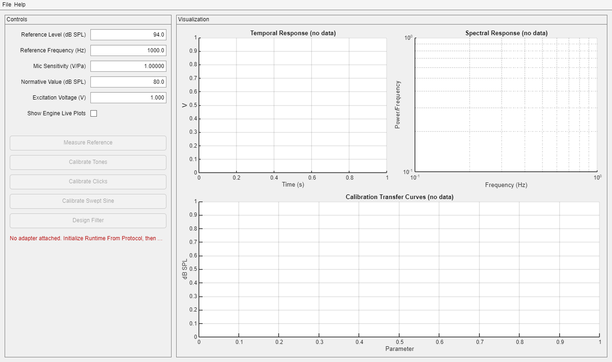

# stimgen.calibration.CalibrationGui



Source file: obj/+stimgen/+calibration/CalibrationGui.m  
Related reference: [stimgen_calibration.md](stimgen_calibration.md)

The screenshot above shows the GUI immediately after construction in [offline mode](#constructor), before `File > Initialize Runtime From Protocol...` has attached an adapter — the calibrate buttons are disabled per [Button Enable Rules](#button-enable-rules) and the status label explains the next step.

CalibrationGui is the standalone calibration UI for the stimgen calibration stack. It owns a `stimgen.calibration.Engine`, can initialize its own `epsych.Runtime` from a protocol file, attaches a compatible hardware interface through `InterfaceAdapter`, and provides interactive controls for reference, tone, click, swept-sine, and filter design workflows.

## What This File Does

CalibrationGui.m implements:

1. Constructor wiring (offline default or pre-built Engine).
2. GUI creation (controls, plots, menu actions).
3. Runtime lifecycle management inside the GUI.
4. Adapter discovery and attachment from runtime interfaces.
5. Calibration execution and state/status updates.
6. Load/save for .esgc calibration files.

## Constructor

Two call patterns are supported:

```matlab
% Offline mode — attach hardware later via File > Initialize Runtime From Protocol:
gui = stimgen.calibration.CalibrationGui()

% Pre-built Engine with adapter already attached:
eng = stimgen.calibration.Engine(adapter);
gui = stimgen.calibration.CalibrationGui(eng)
```

In both cases, if no adapter is attached at construction time, live calibration buttons are disabled until adapter attachment succeeds.

## Creating An Engine

An `Engine` requires an `HwAdapter` for live measurement. The most common adapter for hardware interfaces is `InterfaceAdapter`:

```matlab
% From an hw.Interface object (e.g. from a loaded protocol):
adapter = stimgen.calibration.InterfaceAdapter(iface);
eng = stimgen.calibration.Engine(adapter);
```

For offline use only (voltage lookup from a saved .esgc file):

```matlab
eng = stimgen.calibration.Engine.load('my_cal.esgc');
```

For a Windows sound card workflow:

```matlab
adapter = stimgen.calibration.WindowsSoundCardAdapter(...);
eng = stimgen.calibration.Engine(adapter);
```

Once an engine exists, pass it to `CalibrationGui` or let the GUI create its own via the no-argument constructor and attach hardware from the menu.

## Exact Protocol Requirements For CalibrationGui Compatibility

This section defines the exact requirements for a protocol to be usable with File > Initialize Runtime From Protocol... in CalibrationGui.

### Required protocol-level conditions

1. The protocol must load successfully through epsych.Protocol.load(path).
2. protocol.Interfaces must contain at least one interface object.
3. At least one interface must be connectable (iface.connect() results in iface.IsConnected == true).
4. At least one connected interface must be compatible with stimgen.calibration.InterfaceAdapter.

### Required interface capabilities

A compatible interface must expose the following hw.Parameter names:

1. BufferSize (write)
2. BufferOut (write)
3. x_Trigger (write)
4. BufferIndex (read)
5. BufferIn (read)

If any required parameter is missing, InterfaceAdapter construction fails for that interface.

### Required sample-rate availability

A compatible interface must provide a usable sample rate by one of these paths:

1. One interface module has Fs > 0.
2. An explicit Fs override is supplied to InterfaceAdapter (not currently used by CalibrationGui runtime attach path).

If neither is true, adapter attachment fails with InterfaceAdapter no-sample-rate errors.

### Runtime integration behavior

When initialization is requested:

1. CalibrationGui creates a new epsych.Runtime instance.
2. It assigns runtime.Interfaces = protocol.Interfaces.
3. It connects each interface if needed.
4. It sets runtime interfaces to hw.DeviceState.Preview.
5. It scans interfaces in order and attaches the first one that can build a calibration InterfaceAdapter.

Practical implication:

- If multiple interfaces exist, ordering matters. Put the calibration-capable interface earlier in protocol.Interfaces to ensure deterministic selection.

## Non-Compatible Protocol Patterns

CalibrationGui runtime init will not produce a usable adapter when:

1. The protocol contains only software-only interfaces without required buffer/trigger/readback parameters.
2. Hardware interfaces connect, but required calibration tags are absent.
3. Required tags exist but module Fs is unresolved or zero.
4. Interfaces are present but cannot connect at runtime.

## GUI Menu Workflow (Current)

File menu actions:

1. Initialize Runtime From Protocol...
2. Attach Adapter
3. Disconnect Runtime/Adapter
4. Load .esgc
5. Save .esgc

Recommended sequence:

1. Initialize Runtime From Protocol...
2. Attach Adapter (optional if auto-attach already succeeded)
3. Measure Reference
4. Calibrate Tones
5. Optional: Calibrate Clicks and/or Calibrate Swept Sine
6. Optional: Design Filter
7. Save .esgc

## Calibration Parameter Dialogs

When Calibrate Tones, Calibrate Clicks, or Calibrate Swept Sine is invoked, the GUI prompts for measurement parameters via an input dialog. The previous values are remembered as MATLAB preferences between sessions.

For tones and clicks, the dialog collects:
- Frequency/duration vector (as a comma-separated or `linspace`/`logspace` expression)
- Repeat count (number of averages per point; default 1)

For swept sine, the dialog collects:
- Chirp duration in seconds (default 1)
- Frequency vector (optional override)
- Repeat count (number of chirp captures to average; default 4)

The repeat count is passed directly to `Engine.calibrate_tones`, `Engine.calibrate_clicks`, or `Engine.calibrate_swept_sine` as the `repeatCount` argument.

## Button Enable Rules

1. Measure Reference, Calibrate Tones, Calibrate Clicks, Calibrate Swept Sine: enabled only when Engine.Adapter is attached.
2. Design Filter: enabled only when tone calibration data exists.

## Runtime Ownership And Independence

CalibrationGui now owns runtime state internally:

1. Runtime property stores the GUI-managed epsych.Runtime.
2. Protocol property stores the loaded protocol object.
3. ProtocolFile stores the source path for visibility/debugging.

It does not require StimPlayer runtime handoff to function.

## Error Surfaces You Should Expect

Common errors for incompatible protocols/interfaces:

1. stimgen:calibration:CalibrationGui:noRuntimeInterfaces
2. stimgen:calibration:CalibrationGui:attachAdapterFailed
3. stimgen:calibration:InterfaceAdapter:missingParameter
4. stimgen:calibration:InterfaceAdapter:noSampleRate
5. stimgen:calibration:CalibrationGui:runtimeConnectFailed

These are surfaced in the status label and a uialert dialog.

## Minimal Compatibility Test

Use this quick test after protocol changes:

```matlab
gui = stimgen.calibration.CalibrationGui();
% In GUI: File > Initialize Runtime From Protocol... and select protocol
% Expect: status shows adapter attached, calibration buttons enabled
```

If buttons remain disabled, the selected protocol does not satisfy interface/tag/sample-rate requirements above.

## Maintenance Notes

When editing protocol hardware circuits for calibration support:

1. Keep required parameter names stable.
2. Ensure module Fs is configured and non-zero.
3. Verify connectability before launching CalibrationGui.
4. Re-run the minimal compatibility test.

## See Also

1. [stimgen_calibration.md](stimgen_calibration.md)
2. [stimgen_StimCalibration.md](stimgen_StimCalibration.md)
3. obj/+stimgen/+calibration/InterfaceAdapter.m
4. obj/+stimgen/+calibration/Engine.m
