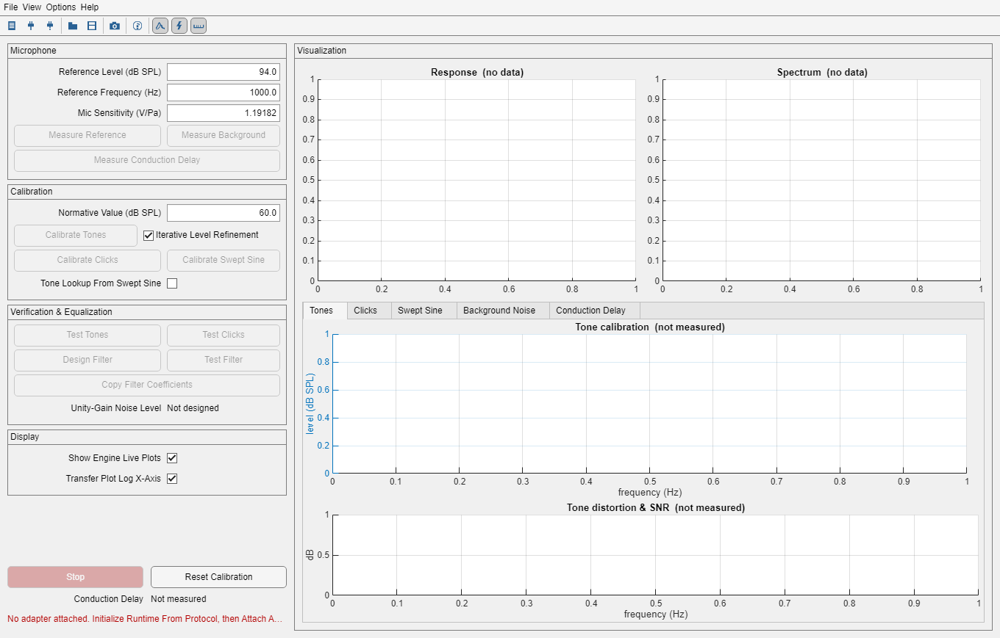

# stimgen.calibration.CalibrationGui



Source file: +stimgen/+calibration/CalibrationGui.m  
Related reference: [stimgen_calibration.md](stimgen_calibration.md)

The screenshot above shows the GUI immediately after construction in [offline mode](#constructor), before `File > Initialize Runtime From Protocol...` has attached an adapter — the calibrate buttons are disabled per [Button Enable Rules](#button-enable-rules) and the status label explains the next step.

CalibrationGui is the standalone calibration UI for the stimgen calibration stack. It owns a `stimgen.calibration.Engine` and provides interactive controls for reference, tone, click, swept-sine, and filter design workflows.

It has no knowledge of any particular hardware or experiment framework. Protocol loading, hardware connection, and adapter construction are delegated to a `stimgen.HardwareHost` supplied by the host application; without one, the GUI runs offline and can still inspect and load saved calibrations.

## What This File Does

CalibrationGui.m implements:

1. Constructor wiring (offline default, pre-built Engine, or host-driven).
2. GUI creation (controls, plots, menu actions).
3. Delegation of runtime lifecycle to the host.
4. Calibration execution and state/status updates.
5. Load/save for .esgc calibration files.

## Constructor

Three call patterns are supported:

```matlab
% Offline mode — no hardware; load/inspect a saved calibration:
gui = stimgen.calibration.CalibrationGui()

% Pre-built Engine with adapter already attached:
eng = stimgen.calibration.Engine(adapter);
gui = stimgen.calibration.CalibrationGui(eng)

% Host-driven — enables File > Initialize Runtime From Protocol:
gui = stimgen.calibration.CalibrationGui(stimgen.calibration.Engine(), host)
```

If no adapter is attached at construction time, live calibration buttons are disabled until adapter attachment succeeds. The runtime menu actions require a host and raise `stimgen:calibration:CalibrationGui:noHost` without one.

## Creating An Engine

An `Engine` requires an `HwAdapter` for live measurement. stimgen ships `stimgen.calibration.WindowsSoundCardAdapter`; host applications supply their own `HwAdapter` implementation for lab hardware:

```matlab
% Built-in sound card adapter:
adapter = stimgen.calibration.WindowsSoundCardAdapter();
eng = stimgen.calibration.Engine(adapter);

% Or a host-supplied adapter:
adapter = host.calibrationAdapter();
eng = stimgen.calibration.Engine(adapter);
```

For offline use only (voltage lookup from a saved .esgc file):

```matlab
eng = stimgen.calibration.Engine.load('my_cal.esgc');
```

For a Windows sound card workflow:

```matlab
adapter = stimgen.calibration.WindowsSoundCardAdapter(...);
eng = stimgen.calibration.Engine(adapter);
```

Once an engine exists, pass it to `CalibrationGui` or let the GUI create its own via the no-argument constructor and attach hardware from the menu.

## Exact Protocol Requirements For CalibrationGui Compatibility

This section defines the exact requirements for a protocol to be usable with File > Initialize Runtime From Protocol... in CalibrationGui. These requirements are expressed against the abstract `stimgen.HardwareHost` contract; a host application is responsible for satisfying them with its own protocol and interface model.

### Required protocol-level conditions

1. The protocol must load successfully through `host.loadProtocol(path)`.
2. The host must expose at least one hardware interface after loading.
3. At least one interface must be connectable via `host.connect()`.
4. At least one connected interface must be able to produce a working `HwAdapter` through `host.calibrationAdapter()`.

### Required interface capabilities

A compatible interface must expose parameters equivalent to:

1. BufferSize (write)
2. BufferOut (write)
3. x_Trigger (write)
4. BufferIndex (read)
5. BufferIn (read)

If any required parameter is missing, `host.calibrationAdapter()` fails to build a working adapter for that interface.

### Required sample-rate availability

A compatible interface must provide a usable sample rate, surfaced through `HwAdapter.sample_rate()`. If no interface can report a nonzero sample rate, adapter attachment fails with a no-sample-rate error.

### Runtime integration behavior

When initialization is requested, CalibrationGui delegates every hardware step to its `stimgen.HardwareHost`:

1. `host.loadProtocol(path)` — load the protocol.
2. `host.connect()` — connect each interface.
3. `host.setMode("Preview")` — put devices in preview mode.
4. `host.calibrationAdapter()` — obtain an `HwAdapter` for the calibration-capable device.

Choosing *which* device can drive calibration is the host's decision, not the GUI's — `calibrationAdapter()` is free to scan available interfaces in whatever order it chooses and return the first that can build a working adapter.

Practical implication:

- If multiple interfaces exist, ordering matters if the host's `calibrationAdapter()` selects by interface order. Consult the host's documentation for how it picks the calibration-capable interface.

## Non-Compatible Protocol Patterns

CalibrationGui runtime init will not produce a usable adapter when:

1. The protocol contains only software-only interfaces without required buffer/trigger/readback parameters.
2. Hardware interfaces connect, but required calibration tags are absent.
3. Required tags exist but module Fs is unresolved or zero.
4. Interfaces are present but cannot connect at runtime.

## GUI Menu Workflow (Current)

File menu actions:

1. Initialize Runtime From Protocol...
2. Attach Adapter
3. Disconnect Runtime/Adapter
4. Load .esgc
5. Save .esgc

A toolbar above the plots mirrors these five actions as icon buttons (built by
`build_toolbar_`) for one-click access; it does not add any behavior beyond
the File menu.

Recommended sequence:

1. Initialize Runtime From Protocol...
2. Attach Adapter (optional if auto-attach already succeeded)
3. Measure Reference
4. Calibrate Tones
5. Optional: Calibrate Clicks and/or Calibrate Swept Sine
6. Optional: Design Filter
7. Save .esgc

## Calibration Parameter Dialogs

When Calibrate Tones, Calibrate Clicks, or Calibrate Swept Sine is invoked, the GUI prompts for measurement parameters via an input dialog. The previous values are remembered as MATLAB preferences between sessions.

For tones and clicks, the dialog collects:
- Frequency vector in Hz / click-duration vector in **milliseconds** (as a comma-separated or `linspace`/`logspace` expression)
- Repeat count (default 1). For clicks this is averages per point; for tones it is passes over the pregenerated burst train, which amounts to the same thing per frequency

For swept sine, the dialog collects:
- Chirp duration in **milliseconds** (default 1000)
- Frequency vector (optional override)
- Repeat count (number of chirp captures to average; default 4)

Durations are entered in milliseconds and converted to seconds before reaching the `Engine`, whose `calibrate_clicks` and `calibrate_swept_sine` signatures are unchanged and still take seconds. The stored preferences use `clickDurationsMs` and `sweptSineDurationMs` keys, so values remembered from a pre-milliseconds session are not silently reinterpreted.

The repeat count is passed directly to `Engine.calibrate_tones`, `Engine.calibrate_clicks`, or `Engine.calibrate_swept_sine` as the `repeatCount` argument.

## Filter Design Dialog

Design Filter prompts for the equalizer design options before running, and remembers them as preferences the same way. Each field maps onto one `Engine.design_filter` argument — see `stimgen_calibration.md` for what they do:

| Field | Argument | Default |
|---|---|---|
| LUT source | `source` | `auto` |
| Number of coefficients | `NumCoefficients` (omitted when 0) | `0` |
| Design method | `DesignMethod` | `freqsamp` |
| Interpolation | `Interpolation` | `pchip` |
| Frequency scale | `FrequencyScale` | `log` |
| Fractional-octave smoothing | `SmoothingOctaves` | `0` |
| Maximum correction depth | `MaxCorrectionDb` | `Inf` |
| Frequency range | `FrequencyRange` (empty = LUT span) | empty |

The status line reports the resulting tap count and correction span, and the design opens in `fvtool`. Each design replaces the fvtool window left by the previous one, so tuning by repeated redesign does not accumulate windows.

## Button Enable Rules

1. Measure Reference, Calibrate Tones, Calibrate Clicks, Calibrate Swept Sine: enabled only when Engine.Adapter is attached.
2. Design Filter: enabled when tone **or** swept sine calibration data exists. `Engine.design_filter` prefers the tone LUT and falls back to swept sine.

## Runtime Ownership And Independence

CalibrationGui holds no runtime or protocol state of its own. It keeps a single `Host` reference (a `stimgen.HardwareHost`, or empty when offline) and asks the host for everything hardware-related. All runtime and protocol objects live on the host side.

This is what keeps stimgen independent of any experiment framework, and it means CalibrationGui does not require a StimPlayer runtime handoff to function.

## Error Surfaces You Should Expect

Raised by the GUI itself:

1. `stimgen:calibration:CalibrationGui:noHost` — a runtime menu action was used with no host attached.

Raised by the host (identifiers are host-specific; the ones below are representative):

2. `<host>:noRuntimeInterfaces` — no interfaces available on the loaded protocol.
3. `<host>:attachAdapterFailed` — no interface could build a working `HwAdapter`.
4. `<host>:missingParameter` — a required buffer/trigger parameter was not found.
5. `<host>:noSampleRate` — no interface reported a usable sample rate.
6. `<host>:connectFailed` — the interface failed to connect.

These are surfaced in the status label and a uialert dialog.

## Minimal Compatibility Test

Use this quick test after protocol changes:

```matlab
gui = stimgen.calibration.CalibrationGui(stimgen.calibration.Engine(), host);
% In GUI: File > Initialize Runtime From Protocol... and select protocol
% Expect: status shows adapter attached, calibration buttons enabled
```

If buttons remain disabled, the selected protocol does not satisfy interface/tag/sample-rate requirements above.

## Maintenance Notes

When editing protocol hardware circuits for calibration support:

1. Keep required parameter names stable.
2. Ensure module Fs is configured and non-zero.
3. Verify connectability before launching CalibrationGui.
4. Re-run the minimal compatibility test.

## See Also

1. [stimgen_calibration.md](stimgen_calibration.md)
2. [stimgen_StimCalibration.md](stimgen_StimCalibration.md)
3. +stimgen/+calibration/Engine.m
