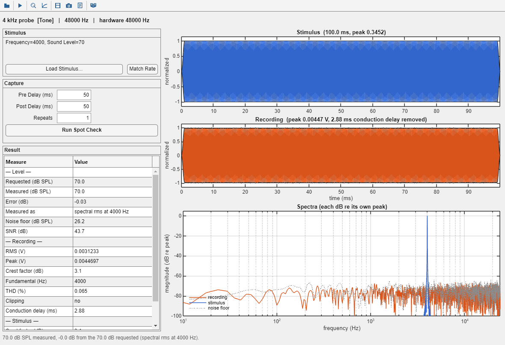

# stimgen.SpotCheck

Play one stimulus through the rig, record it, and characterize what came back.



## What it is for

A calibration answers *"what voltage produces 70 dB SPL at 4 kHz?"* It does not answer
*"does this stimulus — the one about to run in the experiment — actually come out of the
speaker the way it was asked for?"* That is a different question. It is about a whole
waveform rather than a table point, and it gets asked minutes before a session rather
than during a calibration.

A spot check is the answer. Load the stimulus, press Run, and read one number: how far
the level that came back is from the level that was asked for. Everything else on screen
exists to tell you whether to believe that number.

## What it is built from

Three pieces already existed; `SpotCheck` joins them and adds nothing to the analysis.

| Piece | Role |
| --- | --- |
| `stimgen.calibration.Engine.play_and_capture` | plays and records, through whatever `HwAdapter` the rig has, on the same acquisition path every calibration uses |
| `stimgen.CapturedSignal` | carries the microphone record as a `stimgen.StimType`, so a recording can go wherever a stimulus goes |
| `stimgen.StimInspector` | characterizes it — waveform, envelope, spectrum, spectrogram, harmonics, and the full metrics table |

The window itself only sets the capture up, runs it, reports the handful of numbers that
compare the two waveforms, and opens an inspector on each so they can be read side by
side.

Two plots are drawn in the window rather than in an inspector, and only because they are
about the **pair**: the two waveforms on a linked time axis, and their two spectra on one
frequency axis. Neither is a view of a single signal, which is all an inspector holds.

## Quick start

```matlab
addpath('C:\src\stimgen')

adapter = stimgen.calibration.WindowsSoundCardAdapter(SampleRate=48000);
sc = stimgen.SpotCheck(adapter);
sc.load_stimulus('C:\banks\session.spl');   % pick an item if the bank has several
% press Run
```

Headless, against an already-calibrated engine:

```matlab
eng = stimgen.calibration.Engine.load('rigB.esgc');
eng.set_adapter(adapter);

sc = stimgen.SpotCheck(eng, Stimulus=myTone, Show=false);
r  = sc.run;

fprintf('%.1f dB asked, %.1f dB measured, %+.2f dB error\n', ...
    r.stimulus.requested_level_db, r.measured.level_db_spl, r.measured.level_error_db);

sc.describe                       % the whole thing in words
sc.save_results('spotcheck.mat')
```

Constructor arguments are identified by type, so an `Engine`, an `HwAdapter`, a
`HardwareHost` and a `StimType` may be given in any order, or by name
(`Engine=`, `Adapter=`, `Host=`, `Stimulus=`, `Label=`, `Show=`). This is the same
convention `stimgen.calibration.CalibrationGui` uses.

With no adapter the window still opens and a stimulus can still be loaded and inspected;
only Run is unavailable. That matches `StimPlayer` and `CalibrationGui`.

## How the level is measured

This is the part worth understanding, because it is what makes the reported error
trustworthy.

**The measurement follows the stimulus's `CalibrationType`, so the level is measured the
same way the table that calibrated it was measured.**

| `CalibrationType` | measured as | why |
| --- | --- | --- |
| `tone` | spectral rms at the tone frequency | the tone LUT is built from exactly this estimate (`Engine.spectral_rms`) |
| `click` | peak, converted to rms equivalent (÷√2) | the click LUT is built from a peak, and a click train is mostly silence — an rms would read tens of dB low |
| everything else | broadband rms | noise, TORC and sound files have no single frequency to anchor to |

Measuring a tone with a broadband rms instead would fold every bit of room noise in the
record into the number, and read as a calibration error of a decibel or two that is not
there.

Volts become dB SPL through `Engine.spl_from_volts`, which is the one conversion the whole
package reads a level through — the same one `compute_spl_voltage_` builds a LUT with,
`analyze_background_` reduces a noise floor with, and `LiveMonitor` draws its dB SPL
spectrum with:

```
dB SPL = 20*log10( (volts / MicSensitivity) / 20e-6 )
```

The calibrator's `ReferenceLevel` is deliberately not in it; it enters once, in
`calibrate_reference`, where it turns recorded volts into `MicSensitivity`. A spot check
reporting a level on a scale of its own would be worse than useless — it would disagree
with the very tables it exists to check.

The level error is only reported when the stimulus is genuinely calibrated —
`ApplyCalibration` is on **and** it carries calibration data. Otherwise the measured level
is still real, the requested one is not, and a warning says so.

## The capture

`Engine.play_and_capture` surrounds the waveform with silence, and both halves earn
their keep:

- **Pre Delay** is where the noise floor is measured. It is an in-situ floor for this
  record, under the conditions the stimulus was captured in, at no extra acquisition.
- **Post Delay** is the room the response has to arrive late in. It bounds the delay
  search, so **it must be longer than the rig's round-trip latency** — acoustic flight
  time plus converter latency — or the tail of the response falls outside the record and
  cannot be recovered. When the search hits this bound the result says so, loudly.

The response is then cut back to the stimulus's own time base using the delay measured
from the record itself, which is what puts the two waveforms on one axis.

`Repeats` above 1 averages several acquisitions, each aligned on its own measured delay
first, so a latency that shifts between records does not smear the average. Note that
averaging lowers the noise on the response but not on the noise floor it is compared
with, so the reported SNR becomes pessimistic by up to `10*log10(Repeats)` dB. The result
warns when this applies. At the default of one acquisition the two agree exactly.

### Why alignment uses the correlation peak

`play_and_capture` does **not** use `Engine/align_response_`. That method takes the *first*
causal sample to rise above the pre-excitation correlation floor, because it serves
`measure_conduction_delay`, where a delay becomes a distance and following the strongest
return instead of the first arrival would measure a wall reflection and overstate the
path. That rule is right for the click probe it was built around.

It is not right for an arbitrary stimulus. A first-crossing test is only as good as the
threshold under it, and for a continuous excitation the negative-lag floor and the early
causal lags are the same order of magnitude — so the crossing lands wherever the
correlation noise happens to poke through first. Measured against a simulated rig with a
known 137-sample delay:

| stimulus | first-crossing rule | correlation peak |
| --- | --- | --- |
| Noise | 27 / 128 / 130 (varies per draw) | 137 |
| Tone 4 kHz | 0 | 138 |
| Tone 500 Hz | 41 | 139 |
| Click train | 137 | 137 |
| Swept sine | 0 | 138 |
| AM noise | 125 / 128 | 137 |

Nothing here becomes a distance, so there is no reflection to guard against. What this
alignment is for is superimposing the two waveforms so they can be compared, and the
correlation peak is the definition of the shift that does that best.

For a periodic stimulus the peak is ambiguous to within one period — a steady 4 kHz tone
correlates almost as well 12 samples out as on the nose. That is a real ambiguity rather
than an error, and it is harmless: every level and spectrum is computed over the whole
span, where a shift of one period compares like with like. Only the waveform plot can
show it, as a phase offset. `capture.align_quality` reports how unambiguous the peak was;
it sits near 2 for a sustained tone **by nature, not by fault**, so it is a diagnostic
rather than a pass/fail.

## Sample rates

The stimulus and the hardware must already agree. `run` will not change the stimulus to
make them: altering `Fs` regenerates the waveform, and quietly editing an object a caller
is about to run in an experiment is not this tool's decision to make. It raises
`stimgen:SpotCheck:sampleRateMismatch` instead, and `match_hardware_rate` (the **Match
Rate** button) is the explicit fix.

## Variants

Running a stimulus with vectorized properties advances its variant cycle exactly once per
run, so successive runs walk the combinations — which is how a whole bank item gets spot
checked rather than only its first variant. The panel shows which combination is active.

The waveform is regenerated only when `Signal` is empty, so what is measured is the
waveform the object is actually holding. For a noise stimulus this matters: regenerating
would draw a different waveform than the one being reported on.

Values are read through `StimType.active_variant_values`, which reports the combination
that produced the current signal **without** selecting a new one. `selected_value` could
not be used, because outside a variant cycle it reselects — asking would change the
answer.

## Results

`run` returns, and leaves on the object, a struct:

| field | holds |
| --- | --- |
| `stimulus` | what was asked for: class, label, file, fs, duration, calibration type, requested level, how it was measured, anchor frequency, variant state, parameter summary |
| `measured` | what came back: level, error, rms, peak, crest factor, noise floor, SNR, THD, fundamental, clipping, conduction delay |
| `capture` | the raw struct from `play_and_capture`, waveforms included |
| `stimulus_metrics`, `capture_metrics` | full `StimInspector.signal_metrics` structs for the two waveforms, so every number the inspector shows for either is in the saved result too |
| `engine` | mic sensitivity, reference level, output ceiling, AC coupling, spectral window, notes |
| `warnings` | everything that qualifies the numbers above |

`save_results` writes all of that to a plain `.mat`, together with the stimulus in
serialized form and the recording. It is deliberately not a new file format: `load` opens
it and every field is a struct of doubles and strings. A saved spot check is meant to be
readable in a year, when the rig has moved and the bank has been edited, so it carries its
own context rather than a reference to it.

`save_screenshot` writes the whole window — both plots and the table — to an image, for
the cases where the picture is the evidence.

## The warnings

They are the reason to trust or distrust the headline number, and they are worth reading:

- the stimulus is not calibrated, so the requested level is nominal
- the delay search hit its bound, so the record was probably cut in the wrong place
- the recording is clipped, so every level is understated
- the excitation exceeds the output ceiling, so the converter clipped it before the
  speaker saw it
- the record is close to the noise floor, so the level and the distortion figures are
  dominated by noise
- several acquisitions were averaged, so the SNR is pessimistic

## stimgen.CapturedSignal

A recorded waveform wearing the `StimType` interface. It exists so `StimInspector` can
read a recording: the inspector characterizes a `StimType`, and a bare vector cannot be
handed to it. Wrapping the vector is much less invasive than teaching the inspector a
second kind of input, and it buys `plot`, `play` and `plot_spectrogram` for free.

**Nothing is done to the samples.** `update_signal` copies `Waveform` into `Signal` and
stops: no normalization, no gate, no calibration voltage. That is the entire point. A
recording is evidence, and the measured amplitude in volts *is* the evidence; a class that
renormalized it would destroy the one number the capture was made to obtain.
`ApplyCalibration` and `ApplyWindow` default to false to match, and neither is offered in
the generated panel. `Duration` is derived from the record, as `SoundFile` derives it from
the selected file.

Two things about it are deliberate and easy to trip over:

- It lives in a **class folder** rather than as a loose `+stimgen/*.m` file so that
  `StimType.list()` does not glob it. A recording is not a stimulus and must never appear
  in a stimulus dropdown.
- `Waveform` is **absent from `UserProperties`**, because that is what
  `get_variant_source_values_` scans for variant axes — a record of a million samples
  would otherwise become a million variant combinations. The consequence is that it does
  **not** survive `toStruct`/`fromStruct` or a `.spl` bank. It is a session object, not a
  persistence format; use `SpotCheck.save_results` to keep a capture.

## See also

- [`stimgen_calibration.md`](stimgen_calibration.md) — the engine and the calibration workflow
- [`stimgen_CalibrationGui.md`](stimgen_CalibrationGui.md) — the interactive calibration front end
- [`stimgen_StimInspector.md`](stimgen_StimInspector.md) — the analysis this tool delegates to
- [`stimgen_overview.md`](stimgen_overview.md) — the package as a whole
