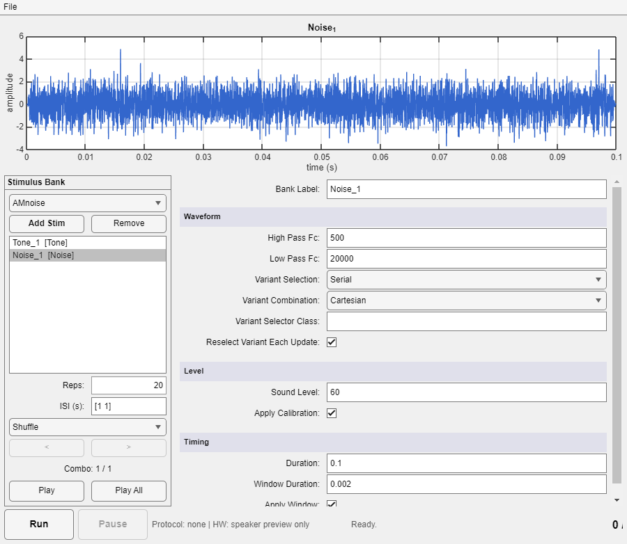

# `stimgen.StimPlayer`



`stimgen.StimPlayer` is a standalone stimulus-bank editor and playback tool
for the `stimgen` package.

The screenshot above shows the three areas described in [UI workflow](#ui-workflow): the signal plot for the selected bank entry (top), the stimulus bank panel with two items (bottom left), and the parameter editor panel for the selected `Noise` stimulus (right).

It is designed for cases where you want to assemble a reusable bank of
stimuli, edit one item at a time, preview signals locally, and optionally
drive the stimgen RPvds playback circuit — all outside a full experiment
session.

## What this class manages

`StimPlayer` owns a bank of `stimgen.StimPlay` objects. Each bank item wraps
one stimulus definition, tracks repetition counts, and exposes the currently
selected waveform.

At the `StimPlayer` level, the class adds:

- a bank list for adding, removing, and renaming stimulus entries
- a parameter editor that rebuilds itself for the selected stimulus type
- a shared playback schedule across bank items using a global `ISI` range
- optional hardware-backed playback through a protocol's hardware interfaces
- save/load support for `.spl` bank files

Use `StimPlayer` when you want a lightweight stimulus workstation rather than
a full experiment session.

## Basic usage

Create the GUI without hardware (speaker preview only):

```matlab
sp = stimgen.StimPlayer;
```

Create it with a `stimgen.HardwareHost` so the `Run` button can write buffers
and trigger hardware playback:

```matlab
sp = stimgen.StimPlayer(HOST);   % a stimgen.HardwareHost implementation
```

Under EPsych, that host is `stimbridge.RuntimeHost`, which wraps a protocol:

```matlab
sp = stimgen.StimPlayer(stimbridge.RuntimeHost('C:\path\to\my.eprot'));
```

A protocol can also be loaded later from the GUI's **File** menu, which
delegates to the host. `StimPlayer` itself holds no runtime or protocol state:
it asks the host to connect the interfaces and put them in Preview mode, then
resolves buffer/trigger parameters through `host.findParameter`. It does not
use the main experiment timer or session runtime.

## UI workflow

The `create()` method builds a single-window UI with three main areas.

### Signal plot

The top panel shows the waveform for the currently selected bank entry.

`update_signal_plot()` refreshes that plot by:

- preferring the listbox selection when the GUI is idle
- falling back to `CurrentSPObj` during active playback
- lazily calling `stimObj.update_signal()` when the signal has not been
  generated yet

If no valid bank entry is available, the plot is cleared to `NaN` data.

### Stimulus bank panel

The left panel manages the bank itself.

Important controls:

- `StimTypeDD`: chooses which concrete `stimgen.StimType` subclass to add
- `Add Stim`: instantiates the selected stimulus type and wraps it in a new
  `stimgen.StimPlay`
- `Remove`: deletes the currently selected bank item
- `BankList`: selects the item shown in the editor panel
- `RepsField`: updates the repetition target for the selected bank item
- `ISIField`: edits the global inter-stimulus interval range used by the
  player timer
- `OrderDD`: chooses the cross-item playback order, `Serial` or `Shuffle`

When you add a new item, `add_stim()` creates the stimulus object,
constructs a `StimPlay`, assigns a default name such as `Tone_1`, and then
selects it so the editor panel is rebuilt immediately.

### Parameter editor panel

The right panel is rebuilt every time the bank selection changes.

`on_bank_selection_changed()` reads metadata from
`stimObj.get_prop_meta()` and groups properties into these sections:

- `Waveform`: stimulus-specific properties such as frequency or filter
  bounds
- `Level`: `SoundLevel` plus `ApplyCalibration`
- `Timing`: duration and window settings
- `Info`: the bank item `Name`

This means `StimPlayer` stays aligned with the underlying stimulus classes.
If a new `StimType` subclass exposes good `propMeta()` metadata, the editor
panel can usually handle it without any `StimPlayer` changes.

## Playback model

`StimPlayer` uses its own MATLAB timer and does not depend on the main
experiment timer.

At run time the class:

1. Resolves hardware parameters from its internal runtime.
2. Regenerates signals for every bank item.
3. Starts a fixed-rate timer.
4. Chooses the next bank index using the player-level `SelectionType`.
5. Writes the stimulus waveform into one of two hardware buffers.
6. Toggles the matching trigger parameter.
7. Logs presentation order and elapsed trigger time.

The player uses ping-pong buffering through `TrigBufferID`, alternating
between buffer `0` and buffer `1` on successive trials.

### Required hardware parameters

Hardware playback is enabled only when the loaded protocol's interfaces
expose these parameter names:

- `BufferData_0`
- `BufferData_1`
- `BufferSize_0`
- `BufferSize_1`
- `x_Trigger_0`
- `x_Trigger_1`

If any are missing, `Run` still starts the timer, but the player logs that
hardware output is unavailable. Local preview through `Play Stim` still
works because that path uses MATLAB audio playback from the underlying
stimulus object.

## Scheduling behavior

There are two scheduling layers to keep in mind.

- `StimPlayer.SelectionType` chooses which bank item is played next.
- Each bank item is a `stimgen.StimPlay`, which can also manage selection
  inside a multi-object or variant-carrying stimulus.

That separation lets you do things like:

- shuffle across several named bank entries
- present each entry serially within its own internal sweep
- repeat the whole bank using a shared `ISI` range

`select_next_idx()` returns `-1` when every bank item has reached its target
repetition count, which ends the session cleanly.

## Saving and loading banks

`StimPlayer` persists banks as `.spl` files saved with MATLAB `save -v7`.

`save_bank()` stores:

- the global `ISI`
- the player-level `SelectionType`
- one serialized struct per `StimPlay` item

`load_bank()` reconstructs each item by:

- creating a new stimulus object from `S.StimObj.Class`
- restoring base `StimType` properties
- restoring the serialized `UserProperties`
- wrapping the result in a new `stimgen.StimPlay`

### Compatibility note

The current loader restores stimulus parameters, names, repetitions, and ISI,
but it does not reapply any serialized calibration object to the rebuilt bank
items. After loading a bank, reattach calibration from the `File >
Calibration` menu or by assigning it in code.

For multi-object stimuli, bank persistence should also be tested carefully.
`StimPlay.toStruct()` serializes expanded child stimuli rather than the
original wrapper object, so round-tripping a multi-object entry through
`.spl` files is less straightforward than round-tripping a single `Tone` or
`Noise` entry.

## Extending the tool

When a new stimulus class is added under `obj/+stimgen`, `StimPlayer` can
usually pick it up automatically because it relies on `stimgen.StimType.list`
and the metadata returned by `get_prop_meta()`.

For new stimulus classes, these details matter most:

- the constructor must be callable with no required positional arguments
- the class should expose clear `propMeta()` labels and limits
- the class should keep its public editable properties in `UserProperties`

If the editor panel looks wrong for a new type, check the class metadata
before changing `StimPlayer` itself.

## Related files

- [+stimgen/@StimPlayer/StimPlayer.m](../../+stimgen/@StimPlayer/StimPlayer.m)
- [+stimgen/StimPlay.m](../../+stimgen/StimPlay.m)

## Related documentation

- [stimgen_overview.md](stimgen_overview.md) — package orientation
- [stimgen_StimPlay.md](stimgen_StimPlay.md) — the per-item scheduling wrapper
- [stimgen_calibration.md](stimgen_calibration.md) — calibrating output levels