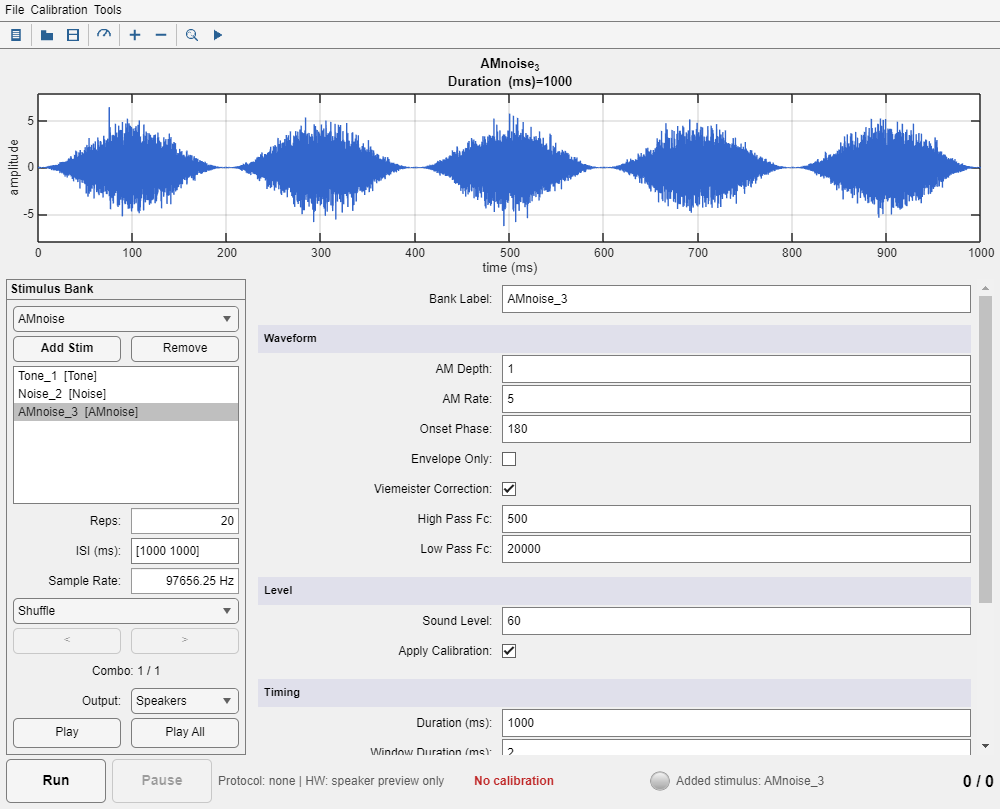

# `stimgen.StimPlayer`



`stimgen.StimPlayer` is a standalone stimulus-bank editor and playback tool
for the `stimgen` package.

The screenshot above shows the three areas described in [UI workflow](#ui-workflow): the signal plot for the selected bank entry (top), the stimulus bank panel with two items (bottom left), and the parameter editor panel for the selected `Noise` stimulus (right).

It is designed for cases where you want to assemble a reusable bank of
stimuli, edit one item at a time, preview signals locally, and optionally
drive the stimgen RPvds playback circuit — all outside a full experiment
session.

## What this class manages

`StimPlayer` owns a bank of `stimgen.StimPlay` objects. Each bank item wraps
one stimulus definition, tracks repetition counts, and exposes the currently
selected waveform.

At the `StimPlayer` level, the class adds:

- a bank list for adding, removing, and renaming stimulus entries
- a parameter editor that rebuilds itself for the selected stimulus type
- a shared playback schedule across bank items using a global `ISI` range
- a single sample rate (`Fs`) for the whole bank
- optional hardware-backed playback through a protocol's hardware interfaces
- save/load support for `.spl` bank files

Use `StimPlayer` when you want a lightweight stimulus workstation rather than
a full experiment session.

## Basic usage

Create the GUI without hardware (speaker preview only):

```matlab
sp = stimgen.StimPlayer;
```

Create it with a `stimgen.HardwareHost` so the `Run` button can write buffers
and trigger hardware playback:

```matlab
sp = stimgen.StimPlayer(HOST);   % a stimgen.HardwareHost implementation
```

A host application's `HardwareHost` implementation typically wraps a protocol, e.g.:

```matlab
sp = stimgen.StimPlayer(host);   % host already has a protocol loaded/connected
```

A protocol can also be loaded later from the GUI's **File** menu, which
delegates to the host. `StimPlayer` itself holds no runtime or protocol state:
it asks the host to connect the interfaces and put them in Preview mode, then
resolves buffer/trigger parameters through `host.findParameter`. It does not
use the main experiment timer or session runtime.

## UI workflow

The `create()` method builds a single-window UI with three main areas.

### Signal plot

The top panel shows the waveform for the currently selected bank entry.

`update_signal_plot()` refreshes that plot by:

- preferring the listbox selection when the GUI is idle
- falling back to `CurrentSPObj` during active playback
- lazily calling `stimObj.update_signal()` when the signal has not been
  generated yet

If no valid bank entry is available, the plot is cleared to `NaN` data.

`update_signal_plot()` is the single funnel for "the displayed stimulus
changed" — bank selection, parameter edits, combination stepping and
`Play All` all pass through it — so it is also where the stimulus inspector
is refreshed. A new code path that changes what should be on screen should
call it rather than updating the plot itself.

### Stimulus inspector

The **Inspect Stimulus** toolbar button (also **File > Inspect Stimulus**,
`Ctrl+I`) opens [`stimgen.StimInspector`](stimgen_StimInspector.md) on the
selected bank item, or raises the existing window if one is already open —
there is only ever one inspector per player.

It is a read-only detail view: waveform and envelope, magnitude spectrum,
spectrogram, harmonic distortion, and a table of measured signal properties.
It stays in sync with the bank because `open_stim_inspector()` attaches it
with a *source provider* (`inspector_source_`) rather than a stimulus handle,
so every refresh re-resolves the current selection instead of holding an
object that may since have been removed.

The inspector is deliberately left enabled during playback — it does not
write to the stimulus — and is closed with the player.

### Stimulus bank panel

The left panel manages the bank itself.

Important controls:

- `StimTypeDD`: chooses which concrete `stimgen.StimType` subclass to add
- `Add Stim`: instantiates the selected stimulus type and wraps it in a new
  `stimgen.StimPlay`
- `Remove`: deletes the currently selected bank item
- `BankList`: selects the item shown in the editor panel
- `RepsField`: updates the repetition target for the selected bank item
- `ISIField`: edits the global inter-stimulus interval range used by the
  player timer, entered in **milliseconds** (`StimPlayer.ISI` itself stays in
  seconds)
- `FsField`: edits the sample rate, in Hz, used to generate every stimulus in
  the bank — see [Sample rate](#sample-rate)
- `OrderDD`: chooses the cross-item playback order, `Serial` or `Shuffle`
- `OutputDD`: chooses where `Play` and `Play All` audition the stimulus —
  see [Preview output and calibration status](#preview-output-and-calibration-status)

`RepsField`, `ISIField`, `FsField`, `OrderDD`, and `OutputDD` can be hidden by an
interfacing application — see
[Hiding session controls](#hiding-session-controls-host-takeover).

When you add a new item, `add_stim()` creates the stimulus object at the bank's
current sample rate, constructs a `StimPlay`, assigns a default name such as
`Tone_1`, and then selects it so the editor panel is rebuilt immediately. A
calibration loaded earlier from the Calibration menu is applied to the new item
as well, so the whole bank always shares one calibration state.

### Sample rate

`stimgen.StimType` carries its own `Fs`, but `StimPlayer` holds **one rate for
the whole bank** — the hardware plays every item through the same converter, so
a per-item rate would have no meaning at Run time. The `Sample Rate` field in
the bank panel shows it, and `StimPlayer.Fs` is the same value programmatically:

```matlab
sp.Fs = 48000;        % rewrites Fs on every bank item and rebuilds their signals
```

Three things keep that single value true:

- `add_stim()` constructs new stimuli with `'Fs', obj.Fs`
- `load_bank()` adopts the first loaded item's rate and re-applies it to the
  rest, reporting in the status line when a bank held mixed rates
- `Run` calls `adopt_host_fs_()`, which takes the rate from
  `HardwareHost.sampleRate()` when the attached host can report one. A host
  that returns `NaN` — the default — leaves the operator's value in place.

A rate change moves Nyquist, so some stimuli cannot survive one: a noise band
above the new Nyquist, or a click shorter than one sample. Assigning `Fs`
therefore applies the rate to every item, rebuilds each signal, and if any item
fails, **rolls the whole bank back** and throws
`stimgen:StimPlayer:SampleRateNotSupported` naming the items and why. The bank
never sits at a rate its signals were not generated at. Bring the offending
stimulus's parameters inside the new range first, then set the rate again.

The rebuild is deliberately run twice per item: assigning `StimType.Fs`
regenerates the signal inside a `PostSet` listener, where MATLAB downgrades an
error to a warning and keeps the stale signal, so `apply_fs_to_bank_()` calls
`update_signal` again where the failure is catchable. This is the same
assign-then-rebuild pattern the parameter editor uses in `set_prop_`.

### Parameter editor panel

The right panel is rebuilt every time the bank selection changes.

`on_bank_selection_changed()` reads metadata from `stimObj.get_prop_meta()`
and buckets properties into sections via
`stimgen.StimType.group_prop_meta()`, in this fixed order:

- `Waveform`: stimulus-specific properties such as frequency or filter
  bounds — the default section for any property that doesn't declare one
- `Level`: `SoundLevel` plus `ApplyCalibration`
- `Timing`: duration and window settings, including any subclass property
  that reinterprets them (e.g. `Tone.WindowMethod`, which is tagged
  `'group', 'Timing'` so it renders next to `WindowDuration` instead of
  drifting into `Waveform`)
- `Variant`: variant selection/combination policy properties

A property opts into a section (and its position within it) via the
optional `group`/`order` fields in its `propMeta()` entry — see
[stimgen_StimType.md](stimgen_StimType.md#display-units). Properties
without a `group` default to `Waveform`, and without an `order` sort after
explicitly ordered ones in declaration order.

Timing fields are entered and displayed in **milliseconds**, and the signal
plot's time axis is in ms; the underlying `StimType` properties stay in
seconds. The conversion comes from the `scale` field in `propMeta`.

Every parameter row, label and widget alike, carries hover help taken from the
`tooltip` field of its `propMeta()` entry, so the explanation is keyed to the
stimulus class rather than to the player — see
[Hover help](stimgen_StimType.md#hover-help). The player's own controls (bank
list, bank label, Reps, ISI, order, combination stepping, preview, Run/Pause,
the status labels and the toolbar) read their text from the same catalog,
`+stimgen/tooltips.json`, under the `StimPlayer` section:

```matlab
tip = @(key) stimgen.util.tooltip('StimPlayer', key);
h.Tooltip = tip('RunBtn');
```

`create.m` builds all of them except the bank label, which belongs to the
rebuilt parameter panel and is set in `on_bank_selection_changed.m`.

The panel registers its widgets with `stimObj.set_gui_handles()` and calls
`stimObj.notify_gui_changed()` after each successful edit, so a stimulus can
repair fields that the edit invalidated — selecting `Tone.WindowMethod`
retitles `Window Duration` and resets it to the new method's default, because
`Tone.on_gui_changed` calls `refresh_gui_widget`. See
[GUI change hooks](stimgen_StimType.md#gui-change-hooks). A subclass writes
that hook once and gets the same behavior here and in the standalone
`create_gui` panel.

This means `StimPlayer` stays aligned with the underlying stimulus classes.
If a new `StimType` subclass exposes good `propMeta()` metadata — including
`group`/`order` where a property belongs somewhere other than `Waveform` —
the editor panel can usually handle it without any `StimPlayer` changes.

### Recent files

The File menu carries three Recent submenus — Recent Protocols, Recent
Stimulus Banks and Recent Calibrations — each listing up to nine
most-recently-used paths, newest first. The lists persist across sessions in
MATLAB preferences under the `StimPlayer` group (`RecentProtocols`,
`RecentBanks`, `RecentCalibrations`) and are separate from the equivalent
`StimCalibrationGui` lists.

An entry is recorded whenever the corresponding file is successfully loaded,
and also when a bank is saved. Re-selecting a path already in a list promotes
it to the top rather than duplicating it. Selecting an entry whose file has
since moved or been deleted does not error: the entry is dropped from the list
and the status label reports the missing path. An empty list shows a disabled
`(None)` item. All three submenus are disabled during playback by
`lock_bank_controls_`, like the load/save items they mirror.

### Toolbar

A toolbar above the signal plot gives one-click access to the most common
actions, each a duplicate of an existing menu item or button: Load Protocol,
Load Bank, Save Bank, Open Calibration GUI, Add Stimulus, Remove Stimulus,
Inspect Stimulus and Play Selected. Toolbar buttons that edit the bank
(Load/Save Bank/Protocol, Open Calibration GUI, Add/Remove Stimulus) are
disabled during playback by `lock_bank_controls_`, the same as their
menu/button counterparts. Inspect Stimulus and Play Selected are not, since
neither edits the bank.

## Preview output and calibration status

`Play` and `Play All` audition through one of two routes, chosen by the
`Output` dropdown in the bank panel (the `PlaybackOutput` property,
`"Speakers"` or `"Hardware"`):

- **Speakers** (default): the computer sound card, via `StimType.play`. The
  signal is normalized to unit peak for audition, so a loaded calibration
  determines spectral shape at most — **calibrated levels are NOT
  reproduced**.
- **Calibrated HW**: the attached host's hardware. The generated waveform
  is played **verbatim**, so a calibrated stimulus drives the output at its
  calibrated voltage. Two hardware contracts can carry the preview, and a
  circuit typically exposes only one of them; the player prefers its own
  playback tags (`BufferData_0`, `BufferSize_0`, `x_Trigger_0` — the same
  contract a Run uses, so a preview exercises the exact route a Run will),
  and falls back to the host's calibration adapter
  (`HardwareHost.calibrationAdapter`, the `BufferOut`/`BufferIn` circuits
  the calibration itself was measured through) when the playback tags are
  absent. The microphone response `play_and_record` returns on the adapter
  route is discarded.

Selecting `Calibrated HW` requires a host and raises
`stimgen:StimPlayer:NoHardwareHost` without one; the dropdown callback
reverts the selection so the GUI never displays a route that cannot play.
Switching onto hardware adopts the host's sample rate (when it reports one)
so the bank is regenerated at the rate the converters run at; at play time
the rate is verified against the hardware and a mismatch raises
`stimgen:StimPlayer:HardwareRateMismatch` rather than playing a waveform at
the wrong pitch and duration. Waveforms peaking beyond ±10 V are refused
(`stimgen:StimPlayer:PreviewVoltageOutOfRange`), and hardware preview is
refused while a Run session is presenting
(`stimgen:StimPlayer:PreviewDuringRun`). If the host has a protocol loaded
but nothing connected yet, the first hardware preview connects it and puts
it in Preview mode — the same steps a Run performs. The resolved adapter is
cached and invalidated whenever the interfaces are released.

Hardware preview blocks until the waveform finishes, so during a hardware
`Play All` cycle the Stop button takes effect between combinations, not
mid-waveform.

A **calibration status label** in the status bar makes the calibration state
unmissable. It answers two questions at once — is a calibration in use, and
does the selected preview output actually reproduce it:

- **Green** `Cal: <file> > HW`: calibration loaded and the hardware route is
  selected — calibrated levels are played.
- **Amber** `Cal: <file> (speakers)`: calibration loaded but speaker preview
  normalizes the signal, so its levels are not reproduced.
- **Red** `No calibration`: no bank item carries calibration data.

Its tooltip carries the details: source path, measurement timestamp, how many
bank items apply it, a warning when the calibration's sample rate differs
from the bank rate, and a reminder that a hardware Run always plays the
generated (calibrated) waveform regardless of the preview output. The label
is maintained by `update_calibration_status_`, called after every event that
can change the answer: loading a calibration, adding or removing bank items,
loading a bank, and switching the preview output.

## Hiding session controls (host takeover)

An interfacing application that owns the session itself can hide the controls
that would otherwise let the operator change it. Hidden controls are made
invisible *and* their grid row/column is collapsed, so no empty space is left
in the layout.

```matlab
sp = stimgen.StimPlayer(HOST);
sp.set_control_visibility(ISI=false, Reps=false, PlayMode=false)  % host sets timing
sp.set_control_visibility(All=false)                              % host runs everything
sp.set_control_visibility(All=false, Run=true)                    % all but Run
```

Hideable controls: `Reps`, `ISI`, `SampleRate`, `PlayMode` (the
`Shuffle`/`Serial` dropdown), `Output` (the preview output dropdown), `Run`,
and `Pause`. A host whose hardware dictates
the converter rate typically hides `SampleRate` and lets `Run` adopt it from
`HardwareHost.sampleRate()`. `All` sets every one at once and is applied
before the individual pairs, so the two can be combined as above. Each accepts
`true`/`false` or `"on"`/`"off"`.

The same state is readable and writable through the `ControlVisibility`
property, which is a scalar struct of logicals:

```matlab
sp.ControlVisibility.Pause = false;   % applies immediately
tf = sp.ControlVisibility.Run;
```

Hiding a control removes only the widget. The corresponding state stays fully
available programmatically — `sp.ISI`, `sp.Fs`, `sp.SelectionType`,
`sp.StimPlayObjs(k).Reps` — and playback can be driven with the action-string
form of `playback_control`:

```matlab
sp.playback_control("Run")      % also "Stop", "Pause", "Resume"
```

Bank editing is unaffected: `lock_bank_controls_` still disables the editing
controls during playback whether or not they are visible.

## Playback model

`StimPlayer` uses its own MATLAB timer and does not depend on the main
experiment timer.

At run time the class:

1. Resolves hardware parameters through `host.findParameter`.
2. Adopts the host's sample rate, when it reports one.
3. Regenerates signals for every bank item.
4. Starts a fixed-rate timer.
5. Chooses the next bank index using the player-level `SelectionType`.
6. Writes the stimulus waveform into one of two hardware buffers.
7. Toggles the matching trigger parameter.
8. Logs presentation order and elapsed trigger time.

The player uses ping-pong buffering through `TrigBufferID`, alternating
between buffer `0` and buffer `1` on successive trials.

### Required hardware parameters

Hardware playback is enabled only when the host resolves all of these
parameter names:

- `BufferData_0`
- `BufferData_1`
- `BufferSize_0`
- `BufferSize_1`
- `x_Trigger_0`
- `x_Trigger_1`

If any are missing, `Run` still starts the timer, but the player logs that
hardware output is unavailable. Local preview through `Play Stim` still
works because that path uses MATLAB audio playback from the underlying
stimulus object.

## Scheduling behavior

There are two scheduling layers to keep in mind.

- `StimPlayer.SelectionType` chooses which bank item is played next.
- Each bank item is a `stimgen.StimPlay`, which can also manage selection
  inside a multi-object or variant-carrying stimulus.

That separation lets you do things like:

- shuffle across several named bank entries
- present each entry serially within its own internal sweep
- repeat the whole bank using a shared `ISI` range

`select_next_idx()` returns `-1` when every bank item has reached its target
repetition count, which ends the session cleanly.

## Saving and loading banks

`StimPlayer` persists banks as `.spl` files saved with MATLAB `save -v7`.

`save_bank()` stores:

- the global `ISI`
- the player-level `SelectionType`
- one serialized struct per `StimPlay` item

`load_bank()` reconstructs each item by:

- creating a new stimulus object from `S.StimObj.Class`
- restoring base `StimType` properties, `Fs` among them
- restoring the serialized `UserProperties`
- wrapping the result in a new `stimgen.StimPlay`
- adopting the first item's `Fs` as the bank rate and re-applying it to the
  rest (see [Sample rate](#sample-rate))

### Compatibility note

The loader restores stimulus parameters, names, repetitions, ISI, and any
calibration serialized with each item. A calibration previously loaded at the
player level belongs to the previous bank, so loading a bank clears it — the
status label then reports the loaded items' own embedded calibrations, or
`No calibration` when they carry none.

For multi-object stimuli, bank persistence should also be tested carefully.
`StimPlay.toStruct()` serializes expanded child stimuli rather than the
original wrapper object, so round-tripping a multi-object entry through
`.spl` files is less straightforward than round-tripping a single `Tone` or
`Noise` entry.

## Extending the tool

When a new stimulus class is added under `+stimgen`, `StimPlayer` can
usually pick it up automatically because it relies on `stimgen.StimType.list`
and the metadata returned by `get_prop_meta()`.

For new stimulus classes, these details matter most:

- the constructor must be callable with no required positional arguments
- the class should expose clear `propMeta()` labels and limits
- the class should keep its public editable properties in `UserProperties`

If the editor panel looks wrong for a new type, check the class metadata
before changing `StimPlayer` itself.

## Related files

- [+stimgen/@StimPlayer/StimPlayer.m](../../+stimgen/@StimPlayer/StimPlayer.m)
- [+stimgen/StimPlay.m](../../+stimgen/StimPlay.m)

## Related documentation

- [stimgen_overview.md](stimgen_overview.md) — package orientation
- [stimgen_StimInspector.md](stimgen_StimInspector.md) — the stimulus detail window
- [stimgen_StimPlay.md](stimgen_StimPlay.md) — the per-item scheduling wrapper
- [stimgen_calibration.md](stimgen_calibration.md) — calibrating output levels